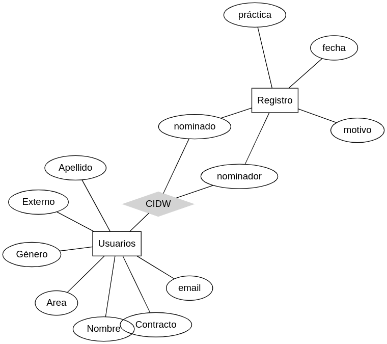
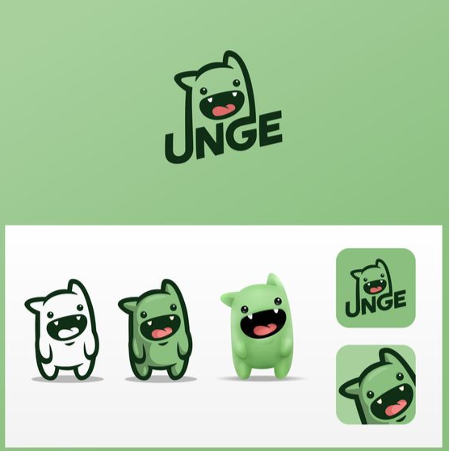
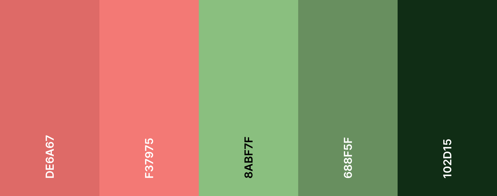
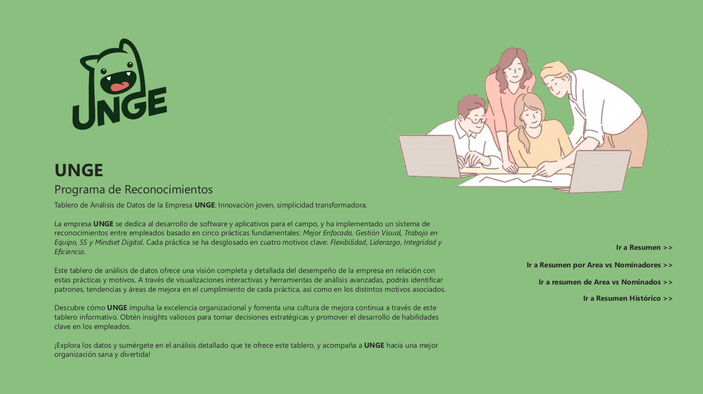
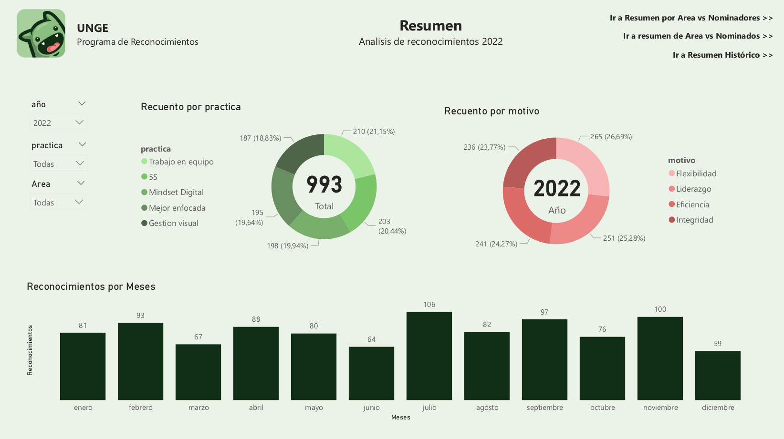
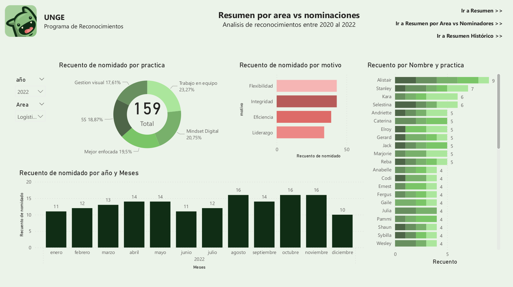
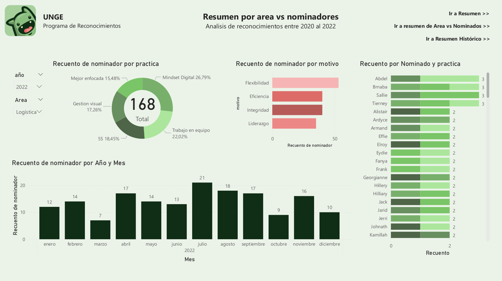
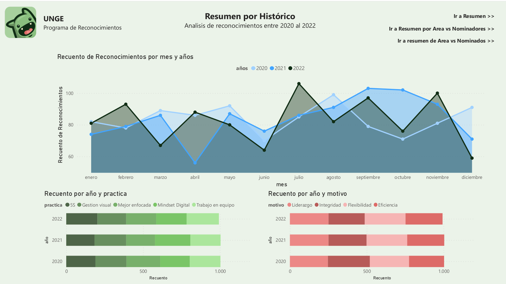

# Coderhouse
## Curso: **Data Analytics**

Comisión: **39895**

Comienza: 27 febrero 2023

Termina: 17 mayo 2023

Instructora: **Rebeca Figueroa**

Tutora: **Loana Gonzalez**

Alumno: **Fernando Javier Barroso Ouharriet**

Dataset 1 - **Programa de Reconocimientos**

---

## Indice
1. **UNGE ¿Qué es Reconocimiento?**
2. **UNGE Análisis de negocio**
    - Tabla de Usuarios
    - Tabla de Registros
    - Diagrama de Relación de Entidades (ERD)
3. **UNGE Análisis de necesidad**
4. **UNGE Hipótesis**
5. **UNGE Métricas**
    - Total acumulado de Recuento de Area en nominador
    - Total acumulado de Recuento de nomidado en Area
    - Total acumulado de Recuento de nominador en Area
6. **UNGE Estilos**
    - Logotipo:
    - Colores:
7. **UNGE Solapas**
    - Resumen
    - Resumen por Área vs Nominaciones
    - Resumen por Área vs Nominadores
    - Resumen por Histórico
    - Relación de tablas:
8. **UNGE MVP**
9. **UNGE Resumen de análisis**

--- 

### Business
## 1 - UNGE ¿Qué es Reconocimiento? 
update: 2023-03-22

La implementación de un programa de reconocimientos en una organización puede ser una estrategia efectiva para fomentar un ambiente laboral positivo y motivar a los empleados. Un sistema de reconocimientos bien estructurado puede ayudar a reconocer el trabajo y los logros de los empleados, lo que puede contribuir a aumentar su compromiso y su productividad.
En este caso, la organización ha optado por un sistema de reconocimientos basado en un sistema de producción que integra 5 prácticas: **Mejor enfocada**, **Gestión visual**, **Trabajo en equipo**, **5S** y **Mindset digital**. Cada práctica se ha dividido en 4 motivos: flexibilidad, liderazgo, integridad y eficiencia.


 - La primera práctica, "**Mejor enfocada**", se enfoca en la identificación y eliminación de desperdicios en el proceso de producción. Los empleados pueden reconocer a sus pares que demuestran flexibilidad al adaptarse a cambios en el proceso de producción, liderazgo al identificar oportunidades de mejora, integridad al cumplir con los estándares de calidad y eficiencia al reducir los tiempos de producción.

 - La segunda práctica, "**Gestión visual**", se centra en la implementación de herramientas visuales para facilitar la gestión del proceso de producción. Los empleados pueden reconocer a sus pares que demuestran flexibilidad al adaptarse a nuevas herramientas, liderazgo al proponer nuevas formas de visualizar la información, integridad al mantener actualizada la información y eficiencia al ahorrar tiempo al acceder a información relevante.

 - La tercera práctica, "**Trabajo en equipo**", se enfoca en la colaboración y el apoyo mutuo entre los empleados. Los empleados pueden reconocer a sus pares que demuestran flexibilidad al adaptarse a diferentes roles dentro del equipo, liderazgo al motivar y guiar al equipo hacia los objetivos, integridad al compartir información de manera transparente y eficiencia al trabajar juntos de manera efectiva para alcanzar los objetivos del equipo.

 - La cuarta práctica, "**5S**", se enfoca en la organización y limpieza del ambiente de trabajo. Los empleados pueden reconocer a sus pares que demuestran flexibilidad al adaptarse a nuevas formas de organización, liderazgo al establecer estándares de limpieza y organización, integridad al mantener el ambiente de trabajo limpio y ordenado y eficiencia al ahorrar tiempo al tener todo organizado y accesible.

Finalmente, la quinta práctica, "**Mindset Digital**", se enfoca en la adopción de tecnologías digitales para mejorar el proceso de producción. Los empleados pueden reconocer a sus pares que demuestran flexibilidad al adaptarse a nuevas tecnologías, liderazgo al proponer nuevas formas de utilizar la tecnología, integridad al cumplir con las políticas de seguridad y privacidad y eficiencia al ahorrar tiempo al utilizar herramientas digitales de manera efectiva.
En conclusión, la implementación de un programa de reconocimientos basado en un sistema de producción que integra 5 prácticas puede ser una estrategia efectiva para motivar a los empleados y fomentar un ambiente laboral positivo. La división de cada práctica en 4 motivos permite a los empleados reconocer diferentes aspectos del trabajo de sus pares, lo que puede contribuir a una evaluación más completa de su desempeño.

Es importante destacar que la implementación de un programa de reconocimientos debe ir acompañada de una cultura organizacional que valore el **Trabajo en equipo** y la colaboración, y que promueva una comunicación efectiva entre los empleados y la dirección. Además, es fundamental que el programa sea justo y equitativo, y que se tenga en cuenta a todos los empleados independientemente de su cargo o posición dentro de la organización.

El programa de reconocimientos también puede incluir recompensas y premios, como bonos o días libres, para incentivar a los empleados a esforzarse aún más en su trabajo y en la adopción de las prácticas de producción establecidas. Estas recompensas pueden ser proporcionales al nivel de logros y desempeño del empleado, y se pueden otorgar de manera regular o en momentos específicos, como en aniversarios de trabajo o en la conclusión de proyectos importantes.

En definitiva, la implementación de un programa de reconocimientos basado en prácticas de producción puede ser una estrategia efectiva para motivar a los empleados y fomentar una cultura de colaboración y mejora continua en la organización. Al valorar el trabajo de los empleados y reconocer sus logros, se puede crear un ambiente laboral más positivo y productivo, que contribuirá a la satisfacción y retención de los empleados y, en última instancia, al éxito de la organización.

## 2 - UNGE Análisis de negocio 
update: 2023-03-22
La implementación de una aplicación en Power Apps para la carga de reconocimientos puede tener varios beneficios para una organización. Algunos de estos beneficios son:
Ahorro de tiempo: La aplicación permitirá a los empleados cargar los reconocimientos de manera rápida y sencilla, lo que reducirá el tiempo necesario para completar esta tarea manualmente.
Registro centralizado: La aplicación permitirá que los reconocimientos se registren de manera centralizada, lo que permitirá a la organización realizar un seguimiento más efectivo de las prácticas de producción adoptadas por sus empleados.

Análisis de datos: La aplicación también permitirá a la organización analizar los datos recopilados sobre los reconocimientos, lo que puede ayudar a identificar tendencias y oportunidades de mejora en las prácticas de producción.

Implementación de la aplicación en Power Apps:
 - Diseño de la aplicación: El primer paso en la implementación de la aplicación en Power Apps es diseñar la interfaz de usuario de la aplicación. Esto incluye la creación de formularios para cargar los reconocimientos, así como la definición de los campos necesarios para registrar los diferentes aspectos de las prácticas de producción.

 - Integración de datos: Una vez diseñada la interfaz de usuario, se debe integrar la aplicación con las fuentes de datos necesarias, como los registros de los empleados y las bases de datos de reconocimientos existentes. Esto asegurará que los datos se guarden y registren de manera adecuada.

 - Pruebas y lanzamiento: Antes de lanzar la aplicación, se deben realizar pruebas exhaustivas para asegurarse de que funciona correctamente y cumple con las necesidades de la organización. Una vez que la aplicación ha pasado las pruebas, se puede lanzar en la organización.

 - Capacitación: Es importante capacitar a los empleados en el uso de la aplicación y en la importancia de la carga adecuada de los reconocimientos. Esto garantizará que se utilice de manera efectiva y que se recopilen los datos necesarios para analizar el desempeño de los empleados.

> En resumen, la implementación de una aplicación en Power Apps para la carga de reconocimientos puede tener varios beneficios para una organización, incluyendo el ahorro de tiempo, la centralización de registros y el análisis de datos. Para implementar la aplicación, se debe diseñar la interfaz de usuario, integrar la aplicación con las fuentes de datos necesarias, realizar pruebas exhaustivas, lanzar la aplicación y capacitar a los empleados en su uso. Con una implementación exitosa, la organización puede mejorar la eficiencia y eficacia de sus prácticas de producción y aumentar la satisfacción y retención de los empleados.

#### Descripción de columnas:
### Tabla de Usuarios ( [Ir](/Usuarios.xlsx) )

| Tipo | Nombre | TYPE | Descripción |
|---|---|---|---|
| PK | CIDW | String | Identificador único de usuario Windows. |
| | Nombre | String | Nombre del participante en la práctica o evento. |
| | Apellido | String | Apellido del participante en la práctica o evento. |
|FK| email | String | Dirección de correo electrónico del participante.|
| | Externo | Bool | Columna validador de personal efectivo |
| | Género | String | Identificación de género registrado en legajo |
| | Contracto | String | Nombre de la empresa contratante |
| | Área | String | Sector de la industria o el negocio al que pertenece la empresa participante.|

### Tabla de Registros ( [Ir](/registros.xlsx) )

| Tipo | Nombre | TYPE | Descripción |
|---|---|---|---|
| | nominador| String| identificador del usuario nominador| 
| | nominado| String| identificador del usuario nominado| 
| | práctica| String| Nombre de la práctica o evento en el que participó el registro.| 
| | motivo| String| Motivo por el que el participante asistió a la práctica o evento.| 
| | fecha| Date| Fecha en que se llevó a cabo la práctica o evento, en formato YYYY-MM-DD.| 
|PK| Registro| Int| número de index|

### Diagrama de Relación de Entidades (ERD)
Codigo generador para https://edotor.net



```
graph ER {
    fontname="Helvetica,Arial,sans-serif"
    node [fontname="Helvetica,Arial,sans-serif"]
    edge [fontname="Helvetica,Arial,sans-serif"]
    layout=neato
    node [shape=box];  Usuarios; Registro;
    node [shape=ellipse]; Nombre;Apellido;email;Externo;Género;Contracto;Area;
        nominador;nominado;práctica;motivo;fecha;
    node [shape=diamond,style=filled,color=lightgrey]; CIDW;

    Usuarios -- CIDW;
    Usuarios -- Nombre[len=1.50];
    Usuarios -- Apellido[len=1.50];
    Usuarios -- email [len=1.50];
    Usuarios -- Externo[len=1.50];
    Usuarios -- Género[len=1.50];
    Usuarios -- Contracto[len=1.50];
    Usuarios -- Area[len=1.50];


    CIDW -- nominador[len=1.50];
    CIDW -- nominado[len=1.50];
    nominado -- Registro[len=1.50];
    nominador -- Registro[len=1.50];
    Registro -- práctica [len=1.50];
    Registro -- motivo[len=1.50];
    Registro -- fecha[len=1.50];

}
```

## 3 - UNGE Análisis de necesidad 
update: 2023-03-22

La implementación de un programa de reconocimientos en una organización es una iniciativa valiosa para mejorar el desempeño de los empleados y aumentar la eficiencia en la producción. Sin embargo, para garantizar que el programa esté cumpliendo con los objetivos establecidos y proporcionando los resultados esperados, es necesario realizar un seguimiento y análisis continuos del comportamiento del programa.

Es por eso que desarrollar un tablero de seguimiento y análisis de comportamiento del programa de reconocimientos es esencial. Algunas de las razones por las cuales es necesario desarrollar un tablero de seguimiento son:
 - Identificación de oportunidades de mejora: Un tablero de seguimiento y análisis permitirá a la organización identificar patrones y tendencias en el comportamiento de los empleados y su participación en el programa de reconocimientos. Esto ayudará a identificar oportunidades de mejora en las prácticas de producción adoptadas y en el programa de reconocimientos en sí mismo.

 - Evaluación del desempeño del programa: Un tablero de seguimiento y análisis permitirá a la organización evaluar el desempeño del programa de reconocimientos en comparación con los objetivos establecidos. Esto permitirá la identificación de las áreas donde se está logrando un mayor impacto y aquellas en las que se requiere un mayor esfuerzo.

 - Comunicación efectiva: Un tablero de seguimiento y análisis también proporcionará una forma clara y efectiva de comunicar los resultados del programa de reconocimientos a los empleados, lo que aumentará la transparencia y la confianza en el programa.

Para implementar un tablero de seguimiento y análisis de comportamiento del programa de reconocimientos, es necesario seguir algunos pasos clave:

 - Definición de objetivos y métricas: El primer paso es definir los objetivos del programa de reconocimientos y las métricas que se utilizarán para medir su impacto. Las métricas pueden incluir el número de reconocimientos entregados, el número de empleados que reciben reconocimientos, la frecuencia de reconocimientos por empleado, entre otras.

 - Identificación de fuentes de datos: El segundo paso es identificar las fuentes de datos necesarias para medir las métricas definidas. Estas fuentes pueden incluir el registro de reconocimientos en la aplicación Power Apps y otras fuentes de datos relevantes para las prácticas de producción adoptadas.

 - Diseño del tablero: El siguiente paso es diseñar el tablero de seguimiento y análisis. El tablero debe ser fácil de usar y presentar de manera clara y efectiva los datos recopilados. Es importante asegurarse de que el tablero sea visualmente atractivo y fácil de interpretar.

 - Implementación y pruebas: Una vez que se ha diseñado el tablero, se debe implementar en la organización y realizar pruebas exhaustivas para asegurarse de que funciona correctamente y cumple con los objetivos definidos.

 - Capacitación: Finalmente, es importante capacitar a los empleados en el uso del tablero y su importancia para la mejora continua del programa de reconocimientos y las prácticas de producción. Esta capacitación puede ser impartida a través de presentaciones, tutoriales y otros recursos de capacitación relevantes.
Conclusiones:
 > En resumen, el desarrollo e implementación de un tablero de seguimiento y análisis de comportamiento del programa de reconocimientos es fundamental para garantizar que el programa esté cumpliendo con sus objetivos y proporcionando los resultados esperados. Al identificar oportunidades de mejora y evaluar el desempeño del programa, la organización puede implementar mejoras continuas y aumentar la eficiencia en la producción y el desempeño de los empleados. Además, la comunicación efectiva de los resultados del programa a través del tablero aumentará la transparencia y la confianza en el programa entre los empleados.

---
### Design
## 4 - UNGE Hipótesis 
update: 2023-05-17

La implementación del sistema de tablero en Power BI para el análisis de datos de UNGE permitirá obtener insights valiosos y tomar decisiones estratégicas fundamentadas. Basándonos en los análisis que se pueden realizar, se plantea la siguiente hipótesis:

 - H1: Existe una correlación positiva entre la mejora enfocada y el rendimiento de los proyectos de desarrollo de software en UNGE. Al analizar los datos relacionados con la práctica de **Mejor Enfocada**, se espera encontrar una asociación significativa entre el nivel de enfoque y la calidad, eficiencia y satisfacción del cliente en los proyectos de desarrollo de software de UNGE.

 - H2: La implementación de la práctica de **Gestión Visual** está relacionada con una mayor eficiencia operativa y una mejor comunicación interna en UNGE. Al analizar los datos de **Gestión Visual**, se espera observar una mejora en la productividad, la gestión del tiempo y la colaboración entre los equipos, lo que se traducirá en un aumento de la eficiencia y la calidad de los procesos en la empresa.

- H3: La promoción del **Trabajo en equipo** en UNGE se traduce en una mayor innovación y resolución de problemas. Al analizar los datos de **Trabajo en Equipo**, se espera identificar una correlación positiva entre la colaboración efectiva, la creatividad y la generación de ideas innovadoras, lo que contribuirá a la mejora continua de los productos y servicios ofrecidos por UNGE.

 - H4: La adopción de las prácticas de las **5S** en UNGE conduce a un entorno de trabajo organizado, seguro y eficiente. Al analizar los datos relacionados con las **5S** (seiri, seiton, seiso, seiketsu y shitsuke), se espera encontrar una relación positiva entre la implementación efectiva de estas prácticas y la productividad, la calidad y la seguridad en el entorno laboral de UNGE.

- H5: El fomento de un **Mindset digital** en UNGE impulsa la adaptabilidad y la innovación en el desarrollo de software y aplicativos. Al analizar los datos relacionados con el **Mindset Digital**, se espera observar una correlación positiva entre la mentalidad digital de los empleados de UNGE y su capacidad para adaptarse a los cambios tecnológicos, así como para generar soluciones creativas y disruptivas.

Estas hipótesis proporcionan un marco para el análisis y la exploración de los datos a través del sistema de tablero en Power BI, con el objetivo de validar o refutar estas suposiciones y proporcionar información valiosa para la toma de decisiones en UNGE.

## 5 - UNGE Métricas 
update: 2023-05-02

### Total acumulado de Recuento de Area en nominador 
La función creada tiene como objetivo calcular el total acumulado del recuento de un área específica en el numerador. 

```sql
Total acumulado de Recuento de Area en nominador = 
CALCULATE(
    COUNTA('Usuarios'[Area]),
    FILTER(
        ALLSELECTED('Registros'[nominador]),
        ISONORAFTER('Registros'[nominador], MAX('Registros'[nominador]), DESC)
    )
)
```
Total acumulado de Recuento de Area en nominador es el nombre de la medida creada en Power BI.
CALCULATE es una función de DAX que se utiliza para realizar cálculos condicionales. En este caso, se utiliza para contar el número de áreas específicas en el numerador.
**COUNTA('Usuarios'[Area])** cuenta el número de valores no vacíos en la columna ***Área*** de la tabla ***Usuarios***.

**FILTER** es otra función de **DAX** que se utiliza para filtrar los datos en función de una condición. En este caso, se utiliza para filtrar los registros de la tabla ***Registros*** que cumplen con la condición especificada.

**ALLSELECTED('Registros'[nominador])** es una función que se utiliza para seleccionar todos los registros de la columna ***Nominador*** de la tabla ***Registros***.

**ISONORAFTER('Registros'[nominador], MAX('Registros'[nominador]), DESC)** es una función que se utiliza para seleccionar los registros que se encuentran después de la última fecha en la columna ***Nominador*** de la tabla ***Registros***. En este caso, se utiliza para seleccionar todos los registros que se encuentran después de la última fecha en la columna ***Nominador*** de la tabla ***Registros*** en orden descendente.

### Total acumulado de Recuento de nomidado en Area 
La función creada tiene como objetivo calcular el total acumulado del recuento de un nominador específico en un área determinada. 

```sql
Total acumulado de Recuento de nomidado en Area = 
CALCULATE(
    COUNTA('Registros'[nomidado]),
    FILTER(
        ALLSELECTED('Usuarios'[Area]),
        ISONORAFTER('Usuarios'[Area], MAX('Usuarios'[Area]), DESC)
    )
)
```
Total acumulado de Recuento de nomidado en Area es el nombre de la medida creada en Power BI.
CALCULATE es una función de DAX que se utiliza para realizar cálculos condicionales. En este caso, se utiliza para contar el número de nominadores específicos en un área determinada.
**COUNTA('Registros'[nomidado])** cuenta el número de valores no vacíos en la columna ***Nominador*** de la tabla ***Registros***.

**FILTER** es otra función de **DAX** que se utiliza para filtrar los datos en función de una condición. En este caso, se utiliza para filtrar los registros de la tabla ***Usuarios*** que cumplen con la condición especificada.

**ALLSELECTED('Usuarios'[Area])** es una función que se utiliza para seleccionar todos los registros de la columna ***Area*** de la tabla ***Usuarios***.

**ISONORAFTER('Usuarios'[Area], MAX('Usuarios'[Area]), DESC)** es una función que se utiliza para seleccionar las áreas que se encuentran después de la última área en la columna ***Area*** de la tabla ***Usuarios***. En este caso, se utiliza para seleccionar todas las áreas que se encuentran después de la última área en la columna ***Area*** de la tabla ***Usuarios*** en orden descendente.

### Total acumulado de Recuento de nominador en Area
La función creada tiene como objetivo calcular el total acumulado del recuento de un nominador específico en un área determinada. 

```sql
Total acumulado de Recuento de nominador en Area = 
CALCULATE(
	COUNTA('Registros'[nominador]),
	FILTER(
		ALLSELECTED('Usuarios'[Area]),
		ISONORAFTER('Usuarios'[Area], MAX('Usuarios'[Area]), DESC)
	)
)
```
Total acumulado de Recuento de nominador en Area es el nombre de la medida creada en Power BI.
CALCULATE es una función de DAX que se utiliza para realizar cálculos condicionales. En este caso, se utiliza para contar el número de nominadores específicos en un área determinada.

**COUNTA('Registros'[nominador])** cuenta el número de valores no vacíos en la columna ***nominador*** de la tabla ***Registros***.

**FILTER** es otra función de **DAX** que se utiliza para filtrar los datos en función de una condición. En este caso, se utiliza para filtrar los registros de la tabla ***Usuarios*** que cumplen con la condición especificada.

**ALLSELECTED('Usuarios'[Area])** es una función que se utiliza para seleccionar todos los registros de la columna ***Area*** de la tabla ***Usuarios***.

**ISONORAFTER('Usuarios'[Area], MAX('Usuarios'[Area]), DESC)** es una función que se utiliza para seleccionar las áreas que se encuentran después de la última área en la columna ***Area*** de la tabla ***Usuarios***. En este caso, se utiliza para seleccionar todas las áreas que se encuentran después de la última área en la columna ***Area*** de la tabla "Usuarios" en orden descendente.


## 6 - UNGE Estilos
update: 2023-05-02

### Documento de Estilo de Marca UNGE
**Logotipo**:


El logotipo de UNGE presenta un monstruo remarcado en líneas, que simboliza la innovación y la creatividad en el desarrollo de software y aplicativos para el campo. El nombre de la empresa se integra con el diseño del logotipo, creando una identidad visual única y reconocible.


**Colores**:
Los colores utilizados en la marca UNGE son los siguientes:



 - ***#DE6A67***: Un rojo intenso y llamativo que simboliza la determinación y la valentía de UNGE para enfrentar desafíos y superar obstáculos en la búsqueda constante de soluciones tecnológicas innovadoras.
 
 - ***#F37975***: Este color rojo cálido y enérgico representa la pasión y la dedicación de UNGE en la creación de aplicativos innovadores, capaces de marcar la diferencia en el campo tecnológico.

 - ***#8ABF7F***: Un verde suave y armonioso que evoca la confianza, la eficiencia y el compromiso de UNGE con la excelencia en el desarrollo de software. Este tono transmite una sensación de equilibrio y profesionalismo.

- ***#688F5F***: Este tono verde transmite frescura, vitalidad y crecimiento, reflejando la capacidad de UNGE para ofrecer soluciones tecnológicas de calidad y alto rendimiento.

- ***#102D15***: Este tono verde oscuro y profundo representa la estabilidad y la solidez de UNGE como empresa líder en el campo del desarrollo de software y aplicativos. Simboliza la confiabilidad y la seguridad que ofrece UNGE a sus clientes.


Estos colores deben utilizarse de manera coherente en todos los materiales de la marca, como el logotipo, el sitio web, los documentos corporativos y cualquier otro elemento visual relacionado con UNGE.


---

### Development
## 7 - UNGE Solapas 
update: 2023-05-02



### Resumen
La pestaña "Resumen" en el dashboard contiene tres gráficos diferentes para proporcionar una vista rápida y clara de los datos clave.


El primer gráfico es un gráfico de anillo que muestra el recuento de prácticas en el conjunto de datos. Este gráfico es útil para ver rápidamente las prácticas más comunes en el conjunto de datos y proporciona una comprensión general de los datos de práctica.
El segundo gráfico es otro gráfico de anillo que muestra el recuento de motivos en el conjunto de datos. Este gráfico permite al usuario comprender rápidamente los motivos más comunes que se han registrado en el conjunto de datos.

El tercer gráfico es un gráfico de barras que muestra el acumulado de recuento de nominadores por mes. Este gráfico es útil para ver cómo los nominadores han sido registrados en el transcurso del tiempo, lo que puede ayudar a los usuarios a identificar patrones o tendencias.

La pestaña "Resumen" también cuenta con filtros que permiten a los usuarios seleccionar el año, la práctica y el área específica que deseen analizar. Estos filtros permiten a los usuarios personalizar los gráficos según sus necesidades y ver los datos específicos que son más relevantes para su análisis.

En general, la pestaña "Resumen" es una vista útil y rápida de los datos clave en el conjunto de datos que ayuda a los usuarios a identificar rápidamente patrones y tendencias. Además, los filtros personalizables permiten a los usuarios profundizar en los datos y obtener una comprensión más detallada del conjunto de datos.

### Resumen por Área vs Nominaciones
La pestaña "Resumen por Área vs Nominaciones" en el dashboard presenta cuatro gráficos diferentes para proporcionar una vista detallada de los datos por área y por nominaciones.


El primer gráfico es un gráfico de anillo que muestra el recuento de prácticas en el conjunto de datos por área. Este gráfico permite al usuario ver las prácticas más comunes en cada área y compararlas con otras áreas.

El segundo gráfico es otro gráfico de anillo que muestra el recuento de motivos en el conjunto de datos por área. Este gráfico permite al usuario comprender rápidamente los motivos más comunes en cada área y compararlos con otras áreas.

El tercer gráfico es un gráfico de barras que muestra el acumulado de recuento de nominadores por mes por área. Este gráfico es útil para ver cómo los nominadores han sido registrados en el transcurso del tiempo por área, lo que puede ayudar a los usuarios a identificar patrones o tendencias en cada área.

El cuarto gráfico es un gráfico de barras horizontales que muestra el recuento por nombre y práctica por área. Este gráfico permite al usuario ver cómo se distribuyen las nominaciones entre los diferentes nombres y prácticas en cada área.

La pestaña "Resumen por Área vs Nominaciones" también cuenta con filtros que permiten a los usuarios seleccionar el año y el área específica que deseen analizar. Estos filtros permiten a los usuarios personalizar los gráficos según sus necesidades y ver los datos específicos que son más relevantes para su análisis.

En general, la pestaña "Resumen por Área vs Nominaciones" es una vista detallada y completa de los datos por área y por nominaciones que ayuda a los usuarios a identificar rápidamente patrones y tendencias específicos de cada área. Además, los filtros personalizables permiten a los usuarios profundizar en los datos y obtener una comprensión más detallada del conjunto de datos.

### Resumen por Área vs Nominadores
La pestaña "Resumen por Área vs Nominadores" en el dashboard presenta cuatro gráficos diferentes que proporcionan una vista detallada de los datos por área y por nominadores.


El primer gráfico es un gráfico de anillo que muestra el recuento de prácticas en el conjunto de datos por área. Este gráfico permite al usuario ver las prácticas más comunes en cada área y compararlas con otras áreas.

El segundo gráfico es otro gráfico de anillo que muestra el recuento de motivos en el conjunto de datos por área. Este gráfico permite al usuario comprender rápidamente los motivos más comunes en cada área y compararlos con otras áreas.

El tercer gráfico es un gráfico de barras que muestra el acumulado de recuento de nominadores por mes por área. Este gráfico es útil para ver cómo los nominadores han sido registrados en el transcurso del tiempo por área, lo que puede ayudar a los usuarios a identificar patrones o tendencias en cada área.

El cuarto gráfico es un gráfico de barras horizontales que muestra el recuento por nombre y práctica por área. Este gráfico permite al usuario ver cómo se distribuyen los nominadores entre los diferentes nombres y prácticas en cada área.

La pestaña "Resumen por Área vs Nominadores" también cuenta con filtros que permiten a los usuarios seleccionar el año y el área específica que deseen analizar. Estos filtros permiten a los usuarios personalizar los gráficos según sus necesidades y ver los datos específicos que son más relevantes para su análisis.

En general, la pestaña "Resumen por Área vs Nominadores" es una vista detallada y completa de los datos por área y por nominadores que ayuda a los usuarios a identificar rápidamente patrones y tendencias específicos de cada área. Además, los filtros personalizables permiten a los usuarios profundizar en los datos y obtener una comprensión más detallada del conjunto de datos.


### Resumen por Histórico
La pestaña "Resumen por Histórico" en el dashboard presenta tres gráficos diferentes que ofrecen una visión histórica de los reconocimientos a lo largo del tiempo.


El primer gráfico es un gráfico de áreas apiladas que muestra el recuento de reconocimientos por mes y año, dividido por áreas. Este gráfico permite al usuario ver cómo los reconocimientos se han distribuido en el tiempo y entre las diferentes áreas. Además, la visualización apilada proporciona una visión general de los patrones y tendencias de reconocimientos en cada área y cómo éstos han cambiado a lo largo del tiempo.

El segundo gráfico es un gráfico de barras apiladas horizontales que muestra el recuento de reconocimientos por año y práctica. Este gráfico permite al usuario ver la distribución de los reconocimientos entre las diferentes prácticas en cada año, lo que puede ser útil para detectar cambios en la popularidad de las prácticas a lo largo del tiempo.

El tercer gráfico es otro gráfico de barras apiladas horizontales que muestra el recuento de reconocimientos por año y motivos. Este gráfico permite al usuario comprender rápidamente los motivos más comunes para los reconocimientos en cada año, lo que puede ser útil para identificar tendencias a lo largo del tiempo.

En general, la pestaña "Resumen por Histórico" proporciona una vista detallada y completa de los reconocimientos a lo largo del tiempo. Los tres gráficos diferentes permiten al usuario ver los datos de diferentes maneras y ofrecen información útil para comprender cómo los reconocimientos han evolucionado a lo largo del tiempo en términos de áreas, prácticas y motivos.


Relación de tablas:

## 8 - UNGE MVP
update: 2023-05-17
.jpg)

El primer MVP de UNGE es un tablero en Power BI que permite analizar los datos relacionados con las prácticas clave implementadas en la empresa: **Mejor Enfocada**, **Gestión Visual**, **Trabajo en Equipo**, **5S** y **Mindset Digital**. El objetivo principal de este MVP es ofrecer una herramienta interactiva que brinde insights y facilite la toma de decisiones estratégicas.

El tablero proporciona visualizaciones y análisis detallados sobre el desempeño de UNGE en cada práctica, desglosada en los motivos de flexibilidad, liderazgo, integridad y eficiencia. Los datos recopilados permiten evaluar el impacto de estas prácticas en el desarrollo de software y aplicativos para el campo.

El MVP busca ofrecer una visión completa y accesible de los datos, utilizando colores y gráficos intuitivos que permiten identificar patrones y tendencias de manera rápida. Los usuarios pueden explorar diferentes métricas, filtrar y desglosar datos, y obtener información valiosa sobre el rendimiento y la eficacia de UNGE en cada práctica.

El primer MVP se enfoca en establecer las bases para futuras iteraciones y mejoras del tablero. Se espera recopilar comentarios y retroalimentación de los usuarios para guiar el desarrollo continuo del producto, asegurando que se satisfagan sus necesidades y se brinde una experiencia de análisis de datos óptima.

En resumen, el primer MVP de UNGE es un tablero en Power BI que analiza los datos relacionados con las prácticas clave implementadas en la empresa, con el objetivo de ofrecer insights valiosos y apoyar la toma de decisiones estratégicas. Este MVP sienta las bases para futuras mejoras y se basa en la retroalimentación de los usuarios para su desarrollo continuo.
9. UNGE* Resumen de análisis
update: 2023-05-17
En el MVP de UNGE, se ha implementado un sistema de cambios de puntajes por regalos materiales, donde los empleados acumulan puntajes en función de la cantidad de reconocimientos obtenidos y la práctica específica a la que pertenecen. A continuación, se presenta un análisis de esta implementación:

Objetivo del sistema de cambios de puntajes:
- El objetivo principal de este sistema es incentivar y reconocer el desempeño de los empleados en base a su participación activa en la mejora de las prácticas establecidas por UNGE. Al acumular puntajes, los empleados tienen la oportunidad de canjearlos por regalos materiales, lo que crea una dinámica motivadora y fomenta la participación en la implementación de las prácticas clave.

- Evaluación del puntaje obtenido: 
La asignación de puntajes se basa en dos factores principales: la cantidad de reconocimientos obtenidos y la práctica específica a la que se refiere cada reconocimiento. Es importante evaluar si esta ponderación de puntajes refleja adecuadamente el impacto de cada práctica en el éxito y el desarrollo de UNGE. Se puede realizar un análisis comparativo para determinar si los puntajes asignados a las diferentes prácticas se ajustan a su importancia relativa.

Análisis del sistema de cambios de puntajes por regalos materiales: 
Es necesario evaluar si el sistema de cambios de puntajes por regalos materiales ha sido efectivo en su implementación. Para ello, se pueden considerar los siguientes aspectos:

- Participación de los empleados: Analizar la cantidad de empleados que están acumulando puntajes y canjeando sus recompensas. Una alta participación indica un interés y motivación por parte del personal.

- Impacto en la cultura y el compromiso: Evaluar si el sistema ha contribuido a fortalecer la cultura organizacional de UNGE y el compromiso de los empleados. Esto se puede medir a través de encuestas de satisfacción y retroalimentación del personal.

- Alineación con los objetivos de la empresa: Determinar si el sistema de cambios de puntajes por regalos materiales está alineado con los objetivos y valores de UNGE. Es importante que el sistema refuerce las prácticas clave y los principios de la empresa.

- Evaluación de resultados: Analizar los resultados obtenidos a partir de la implementación del sistema, como mejoras en la productividad, la calidad del trabajo o la satisfacción del cliente. Estos indicadores pueden proporcionar información valiosa sobre el impacto del sistema en el rendimiento general de UNGE.

> En resumen, en el MVP de UNGE se ha implementado un sistema de cambios de puntajes por regalos materiales basado en la acumulación de reconocimientos y prácticas. Se propone un análisis que evalúe la asignación de puntajes, la efectividad del sistema en términos de participación, impacto en la cultura y alineación con los objetivos de la empresa, así como la evaluación de los resultados obtenidos. Este análisis permitirá identificar posibles áreas de mejora y tomar decisiones informadas para el desarrollo continuo del sistema.
