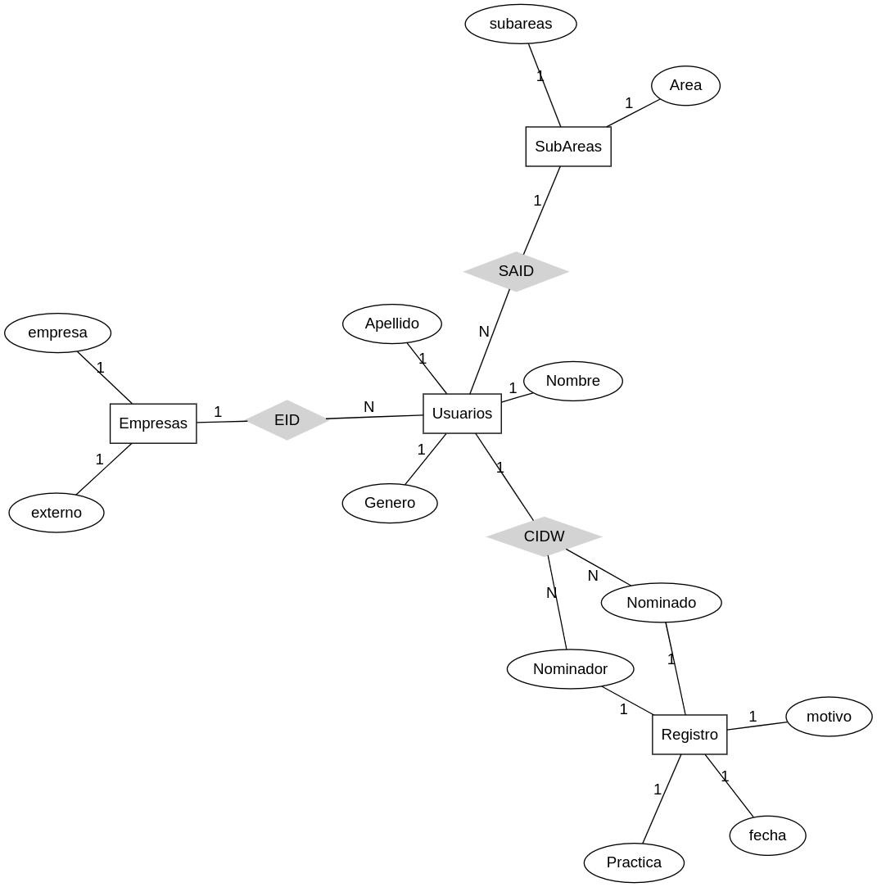
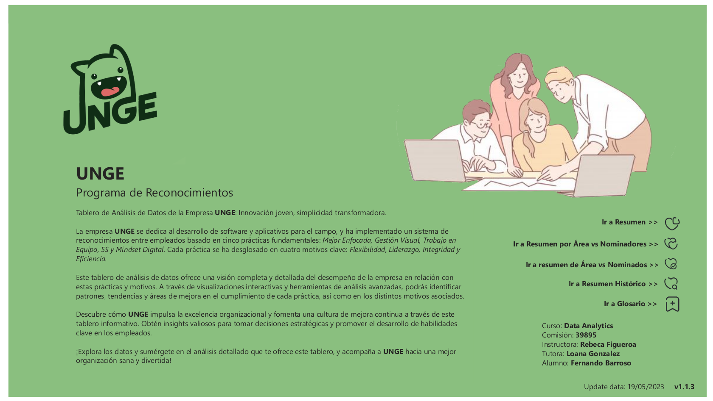

# Coderhouse

## Curso: **Data Analytics**

Comisión: **39895**

Comienza: 27 febrero 2023

Termina: 17 mayo 2023

Instructora: **Rebeca Figueroa**

Tutora: **Loana Gonzalez**

Alumno: **Fernando Javier Barroso Ouharriet**

Proyecto final - **Programa de Reconocimientos**


##  Documentación del Programa de Reconocimientos Interno
---


## Resumen 

Esta documentación presenta un análisis exhaustivo del Programa de Reconocimientos Interno implementado en la empresa **Unge**. A través de un enfoque basado en datos, se examinaron las prácticas, métricas y resultados del programa durante el período de 2020 a 2022. Se exploraron tendencias, se generaron insights y se identificaron áreas de mejora para fortalecer la interacción entre empleados y líderes, promoviendo una cultura organizacional positiva y motivadora. Además, se brindan recomendaciones y próximos pasos basados en la predicción y prescripción de los datos analizados. Esta documentación sirve como guía para optimizar el Programa de Reconocimientos Interno y fomentar un entorno laboral más satisfactorio y productivo.


## Indice
---

1. **Introducción**
    - ¿Qué es Reconocimiento?
    - Análisis de negocio
2. **Descripción de la temática de los datos**
3. **Alcance**
4. **Hipótesis**
5. **Herramientas tecnológicas implementadas**
6. **Datasets**
    - Usuarios
        - Generar CWID
        - Identificador de nómina
        - Generar de subárea
    - Empresas	
    - SubAreas	
    - Registros	
        - Generar fechas de registros
        - Generador único de selección entre Nominador y Nomindo
7. **Diagrama entidad-relación**
8. **Listado de tablas**
    - Usuarios.csv
    - Registros.csv
    - Empresas.csv
    - SubAreas.csv
    - Análisis de Metadatos
9. **Modelo relacional en Power BI**	
10. **Segmentaciones elegidas**	
11. **Medidas calculadas**	
12. **Visualización de los datos**	
    - Portada
    - Glosario
    - Resumen
    - Resumen por Área vs Nominaciones
    - Resumen por Área vs Nominadores
    - Resumen por Histórico
13. **Versiones**	
    - BETA v1.0.0	
    - BETA v1.1.3	
14. **Conclusión**	
15. **Futuras líneas**	


# 1 - Introducción 

En el presente trabajo, se llevó a cabo un análisis exhaustivo del programa interno de reconocimientos implementado en la empresa ficticia "**Unge**", cuyo modelo de negocio se enfoca en el desarrollo de software y aplicativos para el campo. Este programa de reconocimientos se implementó con el objetivo de promover la integración entre empleados y líderes, buscando mejorar significativamente la interacción y la colaboración en el entorno laboral. Debido a la sensibilidad de los datos involucrados, se ha tomado la precaución de no divulgar el nombre del empleador real ni utilizar información específica de la empresa original en este estudio.

## ¿Qué es Reconocimiento?

La implementación de un programa de reconocimientos en una organización puede ser una estrategia efectiva para fomentar un ambiente laboral positivo y motivar a los empleados. Un sistema de reconocimientos bien estructurado puede ayudar a reconocer el trabajo y los logros de los empleados, lo que puede contribuir a aumentar su compromiso y su productividad.
En este caso, la organización ha optado por un sistema de reconocimientos basado en un sistema de producción que integra 5 prácticas: **Mejor enfocada**, **Gestión visual**, **Trabajo en equipo**, **5S** y **Mindset digital**. Cada práctica se ha dividido en 4 motivos: flexibilidad, liderazgo, integridad y eficiencia.


 - La primera práctica, "**Mejor enfocada**", se enfoca en la identificación y eliminación de desperdicios en el proceso de producción. Los empleados pueden reconocer a sus pares que demuestran flexibilidad al adaptarse a cambios en el proceso de producción, liderazgo al identificar oportunidades de mejora, integridad al cumplir con los estándares de calidad y eficiencia al reducir los tiempos de producción.

 - La segunda práctica, "**Gestión visual**", se centra en la implementación de herramientas visuales para facilitar la gestión del proceso de producción. Los empleados pueden reconocer a sus pares que demuestran flexibilidad al adaptarse a nuevas herramientas, liderazgo al proponer nuevas formas de visualizar la información, integridad al mantener actualizada la información y eficiencia al ahorrar tiempo al acceder a información relevante.

 - La tercera práctica, "**Trabajo en equipo**", se enfoca en la colaboración y el apoyo mutuo entre los empleados. Los empleados pueden reconocer a sus pares que demuestran flexibilidad al adaptarse a diferentes roles dentro del equipo, liderazgo al motivar y guiar al equipo hacia los objetivos, integridad al compartir información de manera transparente y eficiencia al trabajar juntos de manera efectiva para alcanzar los objetivos del equipo.

 - La cuarta práctica, "**5S**", se enfoca en la organización y limpieza del ambiente de trabajo. Los empleados pueden reconocer a sus pares que demuestran flexibilidad al adaptarse a nuevas formas de organización, liderazgo al establecer estándares de limpieza y organización, integridad al mantener el ambiente de trabajo limpio y ordenado y eficiencia al ahorrar tiempo al tener todo organizado y accesible.

Finalmente, la quinta práctica, "**Mindset Digital**", se enfoca en la adopción de tecnologías digitales para mejorar el proceso de producción. Los empleados pueden reconocer a sus pares que demuestran flexibilidad al adaptarse a nuevas tecnologías, liderazgo al proponer nuevas formas de utilizar la tecnología, integridad al cumplir con las políticas de seguridad y privacidad y eficiencia al ahorrar tiempo al utilizar herramientas digitales de manera efectiva.
En conclusión, la implementación de un programa de reconocimientos basado en un sistema de producción que integra 5 prácticas puede ser una estrategia efectiva para motivar a los empleados y fomentar un ambiente laboral positivo. La división de cada práctica en 4 motivos permite a los empleados reconocer diferentes aspectos del trabajo de sus pares, lo que puede contribuir a una evaluación más completa de su desempeño.

Es importante destacar que la implementación de un programa de reconocimientos debe ir acompañada de una cultura organizacional que valore el **Trabajo en equipo** y la colaboración, y que promueva una comunicación efectiva entre los empleados y la dirección. Además, es fundamental que el programa sea justo y equitativo, y que se tenga en cuenta a todos los empleados independientemente de su cargo o posición dentro de la organización.

El programa de reconocimientos también puede incluir recompensas y premios, como bonos o días libres, para incentivar a los empleados a esforzarse aún más en su trabajo y en la adopción de las prácticas de producción establecidas. Estas recompensas pueden ser proporcionales al nivel de logros y desempeño del empleado, y se pueden otorgar de manera regular o en momentos específicos, como en aniversarios de trabajo o en la conclusión de proyectos importantes.

En definitiva, la implementación de un programa de reconocimientos basado en prácticas de producción puede ser una estrategia efectiva para motivar a los empleados y fomentar una cultura de colaboración y mejora continua en la organización. Al valorar el trabajo de los empleados y reconocer sus logros, se puede crear un ambiente laboral más positivo y productivo, que contribuirá a la satisfacción y retención de los empleados y, en última instancia, al éxito de la organización.

## Análisis de negocio 

La implementación de una aplicación en Power Apps para la carga de reconocimientos puede tener varios beneficios para una organización. Algunos de estos beneficios son:
Ahorro de tiempo: La aplicación permitirá a los empleados cargar los reconocimientos de manera rápida y sencilla, lo que reducirá el tiempo necesario para completar esta tarea manualmente.
Registro centralizado: La aplicación permitirá que los reconocimientos se registren de manera centralizada, lo que permitirá a la organización realizar un seguimiento más efectivo de las prácticas de producción adoptadas por sus empleados.

Análisis de datos: La aplicación también permitirá a la organización analizar los datos recopilados sobre los reconocimientos, lo que puede ayudar a identificar tendencias y oportunidades de mejora en las prácticas de producción.

Implementación de la aplicación en Power Apps:
 - Diseño de la aplicación: El primer paso en la implementación de la aplicación en Power Apps es diseñar la interfaz de usuario de la aplicación. Esto incluye la creación de formularios para cargar los reconocimientos, así como la definición de los campos necesarios para registrar los diferentes aspectos de las prácticas de producción.

 - Integración de datos: Una vez diseñada la interfaz de usuario, se debe integrar la aplicación con las fuentes de datos necesarias, como los registros de los empleados y las bases de datos de reconocimientos existentes. Esto asegurará que los datos se guarden y registren de manera adecuada.

 - Pruebas y lanzamiento: Antes de lanzar la aplicación, se deben realizar pruebas exhaustivas para asegurarse de que funciona correctamente y cumple con las necesidades de la organización. Una vez que la aplicación ha pasado las pruebas, se puede lanzar en la organización.

 - Capacitación: Es importante capacitar a los empleados en el uso de la aplicación y en la importancia de la carga adecuada de los reconocimientos. Esto garantizará que se utilice de manera efectiva y que se recopilen los datos necesarios para analizar el desempeño de los empleados.

> En resumen, la implementación de una aplicación en Power Apps para la carga de reconocimientos puede tener varios beneficios para una organización, incluyendo el ahorro de tiempo, la centralización de registros y el análisis de datos. Para implementar la aplicación, se debe diseñar la interfaz de usuario, integrar la aplicación con las fuentes de datos necesarias, realizar pruebas exhaustivas, lanzar la aplicación y capacitar a los empleados en su uso. Con una implementación exitosa, la organización puede mejorar la eficiencia y eficacia de sus prácticas de producción y aumentar la satisfacción y retención de los empleados.

# 2 - Descripción de la temática de los datos

El tablero de Power BI se centrará en el análisis de los reconocimientos y el desempeño de los empleados en una organización, basado en las prácticas de producción mencionadas anteriormente: "Mejor enfocada", "Gestión visual", "Trabajo en equipo", "5S" y "Mindset Digital". El objetivo principal del tablero es brindar información visualmente atractiva y fácil de entender sobre el impacto de estas prácticas en el rendimiento de los empleados y en el ambiente laboral en general.

El tablero de Power BI puede incluir varias visualizaciones y paneles interactivos que proporcionen información clave sobre los siguientes aspectos:

 1. Desempeño individual y grupal: El tablero mostrará un resumen del desempeño de cada empleado en relación con las prácticas de producción. Esto puede incluir métricas como la flexibilidad demostrada, el liderazgo ejercido, la integridad mostrada y la eficiencia lograda. Estas métricas se pueden visualizar mediante gráficos de barras, indicadores de rendimiento clave (KPI) o tablas comparativas, lo que permitirá una comparación entre los empleados y el equipo en general.

 2. Evaluación del programa de reconocimientos: El tablero proporcionará una visión general del programa de reconocimientos, destacando la frecuencia y los tipos de reconocimientos otorgados a los empleados. Esto se puede representar mediante gráficos circulares o de dona, lo que permitirá una comprensión rápida de cómo se distribuyen los reconocimientos entre las prácticas de producción y los motivos asociados.

 3. Impacto en el compromiso y la productividad: El tablero mostrará datos sobre el compromiso y la productividad de los empleados antes y después de la implementación del programa de reconocimientos. Estos datos se pueden presentar en forma de gráficos de líneas o áreas, lo que permitirá visualizar las tendencias y los cambios a lo largo del tiempo.

 4. Análisis de correlación: El tablero incluirá visualizaciones que ayuden a identificar posibles correlaciones entre el reconocimiento de los empleados y su desempeño. Esto puede implicar gráficos de dispersión o mapas de calor, lo que permitirá identificar patrones y relaciones entre las prácticas de producción y los resultados obtenidos.


 5 .Recompensas y premios: El tablero mostrará información sobre las recompensas y los premios otorgados a los empleados, como bonos o días libres. Esto puede incluir un resumen de las recompensas más frecuentes, su distribución entre los empleados y su relación con los logros y el desempeño. Gráficos de barras o gráficos de burbujas pueden ser útiles para visualizar estos datos.

 6 .Retroalimentación de los empleados: El tablero puede incluir un panel interactivo que permita a los empleados proporcionar retroalimentación sobre el programa de reconocimientos y las prácticas de producción. Esto se puede lograr mediante formularios interactivos o encuestas integradas en el tablero.

# 3 - Alcance 
El alcance del tablero de Power BI se enfoca en brindar una visión exhaustiva y atractiva desde el punto de vista visual de los datos relacionados. Para lograrlo, se evaluarán los siguientes aspectos:

 1. EDA (Exploratory Data Analysis) de los datos: El tablero puede mostrar un análisis exploratorio de los datos recopilados en relación con el programa de reconocimientos. Esto puede incluir información demográfica de los empleados, métricas clave de desempeño y datos relevantes para cada una de las prácticas de producción. El objetivo es obtener una comprensión completa de los datos disponibles y su distribución.

 2. Evolución y comportamiento histórico: El tablero puede proporcionar una visualización de la evolución y el comportamiento histórico del programa de reconocimientos y las prácticas de producción en la empresa. Esto puede incluir gráficos de líneas o áreas que muestren la frecuencia de reconocimientos a lo largo del tiempo, así como la implementación y adopción de las diferentes prácticas. Esto permitirá identificar tendencias, cambios y patrones a lo largo del tiempo.

 3. Evaluación de relaciones entre empleados: El tablero puede incluir visualizaciones interactivas que permitan evaluar las relaciones entre los empleados en función de los reconocimientos recibidos y otorgados. Esto puede implicar gráficos de red o diagramas de dispersión que muestren la interacción entre los empleados y cómo se relacionan en términos de prácticas de producción, motivos y niveles de reconocimiento. Esto ayudará a identificar patrones de colaboración y destacar las conexiones entre los empleados.

 4. Análisis del EDA para simular la implementación de un sistema de recompensa: El tablero puede permitir la simulación de la implementación de un sistema de recompensas basado en los datos del programa de reconocimientos. Esto podría incluir la asignación de puntos o niveles de recompensa a los empleados en función de su desempeño y participación en las prácticas de producción. Se podrían crear visualizaciones que muestren cómo cambiarían los niveles de recompensa y cómo se distribuirían entre los empleados, lo que permitiría evaluar el impacto potencial del sistema de recompensas en la estimulación de su uso.

> En general, el alcance del tablero se centra en proporcionar una visión integral de los datos relacionados con el programa de reconocimientos, incluyendo el análisis histórico, la evaluación de relaciones entre empleados y la simulación de un sistema de recompensas. Esto permitirá a la empresa comprender mejor los patrones de desempeño, mejorar la interacción entre los empleados y evaluar las estrategias para estimular el uso del programa de reconocimientos.

# 4 - Hipótesis
Al implementar medidas estratégicas para mejorar el programa de reconocimientos, como la optimización de las prácticas de producción, la promoción de una cultura colaborativa y el establecimiento de un sistema de recompensas equitativo, se espera que se incremente la participación de los empleados y se fomente un ambiente laboral más motivador y productivo en la empresa "**Unge**", dedicada al desarrollo de software y aplicativos para el campo. Esto debería reflejarse en un aumento en el nivel de compromiso y satisfacción de los empleados, así como en una mejora en los indicadores clave de desempeño y en la calidad de los resultados obtenidos.

# 5 - Herramientas tecnológicas implementadas
En el proceso de análisis y creación del dashboard se utilizaron diversas herramientas y tecnologías, entre las cuales se destacan:

 - **Python**: Se empleó para la creación del dataset y el análisis de los datos. Python ofrece una amplia gama de bibliotecas y herramientas para el procesamiento y análisis de datos, lo cual resulta útil para realizar tareas como la limpieza, transformación y manipulación de datos.
 - **Power BI**: Se utilizó como la plataforma principal para la creación del dashboard. Power BI es una herramienta de visualización de datos que permite crear paneles interactivos y atractivos, y ofrece diversas opciones para la presentación y exploración de los datos.
 - **Archivos CSV**: Los archivos CSV (Comma-Separated Values) fueron utilizados para almacenar y representar las tablas de datos utilizadas en el análisis. Los archivos CSV son un formato comúnmente utilizado para el intercambio de datos tabulares, lo cual facilita su manipulación y lectura tanto en Python como en Power BI.
 - **Miro**: Se empleó para el análisis de contenido y el planeamiento. Miro es una plataforma de colaboración en línea que permite crear y compartir tableros virtuales, lo cual resulta útil para organizar ideas, realizar diagramas y planificar el enfoque del proyecto.
 - **Gimp**: fue utilizado para el tratamiento de las imágenes utilizadas en el dashboard. Gimp es un software de edición de imágenes gratuito y de código abierto que proporciona herramientas para la manipulación y mejora de imágenes, como la edición de tamaño, ajustes de color y retoques.
 - **Pinterest**: Se utilizó como una herramienta de búsqueda de recursos visuales. Pinterest es una plataforma que permite descubrir y guardar imágenes, gráficos y diseños inspiradores, lo cual resulta útil para encontrar ideas y ejemplos de diseño para el dashboard.
 - **Editor.net**: Se empleó Editor para la creación del diagrama ERD (Entity-Relationship Diagram). Editor.net es un editor en línea que ofrece herramientas para la creación y diseño de diagramas ERD, los cuales ayudan a visualizar y comprender la estructura y relaciones de una base de datos.
 - **Google Docs** y **Google Drive**: Google Docs se utilizó para la confección de documentación relacionada con el proyecto, ya que proporciona herramientas de edición de texto colaborativas y almacenamiento en la nube. Google Drive fue utilizado para alojar y compartir los archivos de contenido y recursos utilizados en el proyecto.
 - **Aicolors.co**: Se utilizó Aicolors para la selección y diseño del brand del negocio. Aicolors.co es una herramienta en línea que proporciona paletas de colores generadas automáticamente, lo cual facilita la elección de una combinación de colores armoniosa y coherente para el branding.
 - **Mockaroo**: se utilizó la herramienta **Mockaroo** para la creación de un dataset de usuarios ficticios. **Mockaroo** es una herramienta en línea que permite generar conjuntos de datos simulados de manera rápida y sencilla.

> En resumen, estas herramientas y tecnologías fueron utilizadas en conjunto para el análisis, diseño y creación del dashboard, abarcando desde la manipulación de datos en Python y **Mockaroo**, hasta la visualización interactiva en Power BI, pasando por el tratamiento de imágenes, el diseño de paletas de colores y la colaboración en línea mediante plataformas como Miro y Google Docs.

# 6 - Datasets
## Dataset 1 - Usuarios

En el proceso de construcción de los datasets utilizados en el análisis, se implementó el uso de la herramienta [https://www.**mockaroo**.com/](https://www.**mockaroo**.com/)  con una configuración específica. Esta herramienta permitió generar datos ficticios de manera rápida y personalizada para simular usuarios en el contexto de una empresa ficticia llamada "**Unge**", junto con otras empresas reconocidas en el sector.

La configuración utilizada en **Mockaroo** incluyó la generación de atributos como el nombre (first_name), el apellido (last_name) y el género (gender). Además, se generaron datos de la empresa (company) utilizando una opción aleatoria (random) entre una selección de empresas como "**Unge**", "Randstad", "Hays", "Page Personnel", "ManpowerGroup", "Kelly Services", "Adecco" y "Robert Half".

También se generaron datos relacionados con el área (department) de los usuarios, utilizando nuevamente la opción aleatoria (random) entre áreas como logística, mantenimiento, calidad, finanzas, producción y planificación.

Esta configuración en **Mockaroo** permitió crear datasets simulados que representan usuarios ficticios con nombres, apellidos, género, empresa y área dentro de la organización. Estos datos son fundamentales para el análisis y la visualización en el dashboard, ya que proporcionan una base sólida para evaluar el desempeño, las relaciones y otros aspectos relevantes en el entorno laboral.


El dataset *MOCK_DATA.csv* obtenido contiene datos simulados de usuarios ficticios generados a través de la herramienta **Mockaroo**. Cada fila del dataset representa un usuario y las columnas corresponden a los atributos mencionados anteriormente.

| Nombre | TYPE | Descripción |
|---|---|---|
| Nombre | String | Nombre del usuario simulado |
| Apellido | String | Apellido del usuario simulado |
| Genero | String | Género del usuario simulado (masculino o femenino) |
| Empresa | String | Empresa a la que pertenece el usuario simulado |
| Área | String | Área o departamento en el que trabaja el usuario simulado |

En el proceso de generación del dataset *MOCK_DATA.csv*, se implementó una función denominada "**generate_unique_word**" con el propósito de generar una columna identificadora única para cada usuario simulado. Esta columna se denominó "**CWID**" (Custom Windows ID) y se utilizó para asignar un identificador único a cada registro de usuario en el dataset.

### Generar CWID:

```python
registroCWID = []
def generate_unique_word(text):
   word = ''.join(np.random.choice(list(string.ascii_uppercase), size=6))
   while word in registroCWID:
       word = ''.join(np.random.choice(list(string.ascii_uppercase), size=6))
   registroCWID.append(word)
   return word

usuarios["CWID"] = usuarios["Nombre"].apply(generate_unique_word)
```

Descripción de su uso:
La función "**generate_unique_word**" se diseñó para generar una palabra única de seis caracteres en mayúsculas mediante el uso de la biblioteca random de Python. Esta palabra se crea seleccionando aleatoriamente letras mayúsculas del alfabeto y concatenándolas para formar la palabra.

### Identificador de nómina:

```python
def plant_employee(empresa):
   if empresa in ["Unge", "Hays"]:
       return "Local"
   else:
       return "Externo"

usuarios["Externo"] = usuarios["Empresa"].apply(plant_employee)
```
La función "**plantEmployee**(empresa)" es una función que recibe un parámetro "empresa" y devuelve un valor booleano. La función tiene la siguiente descripción:
 - Si el valor de "empresa" es igual a "Unge", la función devuelve False, lo que indica que el empleado no está contratado en la planta de esa empresa específica.
 - En caso contrario, es decir, si el valor de "empresa" es distinto de "Unge", la función devuelve True, lo que indica que el empleado está contratado en la planta de esa empresa.

### Generar de subárea:

```python
def assign_subarea(sector):
   return random.choice(subareas[sector])

usuarios["SubArea"] = usuarios["Área"].apply(assign_subarea)
```
La función assign_subarea se encarga de asignar de manera aleatoria una subárea a los usuarios en función de su sector. Esta función es utilizada en el contexto de una tabla de usuarios, donde se desea agregar una nueva columna llamada "SubArea" que refleje la asignación de subáreas a cada usuario.

Resultado obtenido:


Exportación de tabla final
```python
usuarios.to_csv("Usuarios.csv",index=False)
```

## Dataset 2 - Empresas
Se generó una tabla de empresas de forma aleatoria utilizando IDs únicos y la función "**generate_unique_word**". Se actualizaron los usuarios para establecer la conexión de datos con las empresas. Se agregaron campos en la tabla de usuarios para vincularlos con las empresas correspondientes. Esto permitió un análisis completo de los datos, generando consultas e informes que involucran a usuarios y empresas, brindando una visión integral de la información.

```python
# Nueva tabla de empresas
empresas = usuarios.drop_duplicates(subset="Empresa")[["Empresa", "Externo"]]
empresas["EID"] = empresas["Empresa"].apply(generate_unique_word)
```
Resultado obtenido:


Exportación de tabla final
```python
empresas.to_csv("Empresas.csv", index=False)
```

## Dataset 3 - SubAreas
Se generó una tabla de subareas de forma aleatoria utilizando IDs únicos y la función "**generate_unique_word**". Se actualizaron los usuarios para establecer la conexión de datos con las empresas. Se agregaron campos en la tabla de usuarios para vincularlos con las empresas correspondientes. Esto permitió un análisis completo de los datos, generando consultas e informes que involucran a usuarios y empresas, brindando una visión integral de la información.

```python
# Nueva tabla de SubAreas
subareas_table = usuarios.drop_duplicates(subset="SubArea")[["Área", "SubArea"]]
subareas_table["SAID"] = subareas_table["SubArea"].apply(generate_unique_word)
subareas_table = subareas_table[["Área", "SubArea", "SAID"]].drop_duplicates()
```
Resultado obtenido:


Exportación de tabla final
```python
subareas_table.to_csv("SubAreas.csv", index=False)
```

A raíz de la creación de las tablas "Empresa" y "SubAreas", se lleva a cabo una actualización en la tabla "Usuarios" con el fin de establecer una conexión de datos entre ellas.
```python
# Combinación de IDs
usuarios = usuarios.merge(empresas, how='left', on='Empresa')
usuarios = usuarios.merge(subareas_table, how='left', on='SubArea')
usuarios = usuarios[["Nombre", "Apellido", "Genero", "CWID", "EID", "SAID"]]
```
## Dataset 4 - Registros
En base a la tabla de usuarios, se generó de manera aleatoria una tabla de registros utilizando dos funciones clave, las cuales se describen a continuación:


### Generar fechas de registros:
Para agregar una hora aleatoria entre las 8:00 y las 17:00 a las fechas generadas por la función anterior, se puede utilizar el módulo *random* y el método *time* de la clase *datetime*. Aquí te dejo el código actualizado de la función **generate_random_weekday_date** que incluye también la hora aleatoria:

```python
def generate_random_weekday_date():
   year = random.randint(2020, 2022)
   month = random.randint(1, 12)
   day = random.randint(1, 28)
   hour = random.randint(8, 16)
   minute = random.randint(0, 59)
   second = random.randint(0, 59)
   date = datetime.datetime(year, month, day, hour, minute, second)
   while date.weekday() > 4:
       year = random.randint(2020, 2022)
       month = random.randint(1, 12)
       day = random.randint(1, 28)
       hour = random.randint(8, 16)
       minute = random.randint(0, 59)
       second = random.randint(0, 59)
       date = datetime.datetime(year, month, day, hour, minute, second)
   return date
```

### Generador único de selección entre Nominador y Nomindo
select_random_item: Esta función selecciona aleatoriamente un elemento de una lista y se asegura de que el elemento seleccionado no sea anterior al elemento previamente seleccionado. Utiliza un bucle while y random.choice para seleccionar un nuevo elemento hasta que se cumpla la condición requerida.

```python
def select_random_item(lst):
   selected_item = random.choice(lst)
   while True:
       new_item = random.choice(lst)
       if new_item >= selected_item:
           return [new_item, selected_item]
```

El siguiente código genera 3000 registros, donde cada registro tiene un identificador único ("id"), un "nominador" y un "nominado" seleccionados al azar de la lista "registroCWID" utilizando la función "select_random_item", una "práctica" y un "motivo" seleccionados al azar de las listas "Practicas" y "Motivos" respectivamente, y una "fecha" generada aleatoriamente de lunes a viernes utilizando la función "generate_random_weekday_date".

```python
# Creación de tabla de registros
practicas = ["Mejor enfocada", "Gestión visual", "Trabajo en equipo", "5S", "Mindset digital"]
motivos = ["Flexibilidad", "Liderazgo", "Integridad", "Eficiencia"]

registros = [{
   "id": n+1,
   "nominador": selected_item[0],
   "nominado": selected_item[1],
   "práctica": random.choice(practicas),
   "motivo": random.choice(motivos),
   "fecha": generate_random_weekday_date()
} for n, selected_item in enumerate(select_random_item(list(usuarios["CWID"])) for _ in range(3000))]

data = pd.DataFrame(registros)

data.to_csv("Registros.csv",index=False)
```
La tabla final tiene un total de 3000 registros, donde cada registro tiene un identificador único, un nominador, un nominado, una práctica, un motivo y una fecha asociados.


# 7 - Diagrama entidad-relación
El siguiente código representa la creación de un diagrama de relación de entidades utilizando el editor de diagramas en línea llamado Edotor. Este tipo de diagrama se utiliza para visualizar las relaciones entre las entidades de un sistema o base de datos. En este caso, se ha utilizado el código para representar la relación entre las entidades "Usuarios" y "Registro", junto con sus atributos correspondientes.

```r
graph ER {
    fontname = "Helvetica, Arial, sans-serif"
    node [fontname = "Helvetica, Arial, sans-serif"]
    edge [fontname = "Helvetica, Arial, sans-serif"]
    layout = neato
    node [shape = box] Usuarios; Registro; Empresas; SubAreas;
    node [shape = ellipse]
        Nombre;Apellido; Genero; Area;
        Nominador;Nominado; Practica; motivo; fecha; subareas;
        empresa; externo;
    node [shape=diamond,style=filled,color=lightgrey]; CIDW; EID; SAID;


    Usuarios -- CIDW  [label = "1" len=1.50];
    Usuarios -- Nombre [label = "N" len=1.50];
    Usuarios -- Apellido [label = "N" len=1.50];
    Usuarios -- Genero [label = "N" len=1.50];
    Usuarios -- EID [label = "N" len=1.70];
    Usuarios -- SAID [label = "N" len=1.50];


    SubAreas -- SAID [label = "1" len=1.50];
    SubAreas -- Area [label = "N" len=1.50];
    SubAreas -- subareas [label = "1" len=1.50];


    Empresas -- EID [label = "1" len=1.50];
    Empresas -- empresa [label = "1" len=1.50];
    Empresas -- externo [label = "1" len=1.50];


    CIDW -- Nominador [label = "N" len=1.50];
    CIDW -- Nominado [label = "N" len=1.50];


    Registro -- Nominado [label = "N" len=1.50];
    Registro -- Nominador [label = "N" len=1.50];
    Registro -- Practica  [label = "N" len=1.50];
    Registro -- motivo [label = "N" len=1.50];
    Registro -- fecha [label = "1" len=1.50];
}
```


# 8 - Listado de tablas
La tabla proporciona una descripción detallada de los campos presentes en ella. A continuación, se presenta una breve reseña de cada campo:
 - Tipo: Indica la característica única usando el identificador PF o FK.
 - Nombre: Representa el nombre del campo en la tabla. Es un identificador descriptivo que indica el propósito o contenido del campo.
 - Formato:  Indica el tipo de dato que se almacena en el campo. En este caso, los tipos de datos incluyen "String" (cadena de caracteres) y "Bool" (booleano).
 - Descripción: Proporciona una breve descripción del contenido o la función del campo en la tabla. Es útil para comprender mejor el propósito o el contexto del campo.


### Usuarios.csv
| Tipo | Nombre | TYPE | Descripción |
|---|---|---|---|
|PK|CIDW|String|Identificador único de usuario Windows.|
||Nombre|String|Nombre del participante en la práctica o evento.|
||Apellido|String|Apellido del participante en la práctica o evento.|
||Género|String|Identificación de género registrado en legajo|
|FK|EID|String|ID de tablade empresa contratante|
|FK|SAID|String|ID de sub área al que pertenece la empresa participante.|

### Registros.csv
| Tipo | Nombre | TYPE | Descripción |
|---|---|---|---|
|FK|nominador|String|identificador del usuario nominador|
|FK|nominado|String|identificador del usuario nominado|
||práctica|String|Nombre de la práctica o evento en el que participó el registro.|
||motivo|String|Motivo por el que el participante asistió a la práctica o evento.|
||fecha|Date|Fecha en que se llevó a cabo la práctica o evento, en formato YYYY-MM-DD.|
|PK|ID|Int|número de index|


### Empresas.csv
| Tipo | Nombre | TYPE | Descripción |
|---|---|---|---|
||Empresa|String|Nombre de la empresa.|
||Externo|String|Indicador tipo de nómina.|
|PK|EID|String|ID único de la empresa.|

### SubAreas.csv
| Tipo | Nombre | TYPE | Descripción |
|---|---|---|---|
|FK|Área|String|Nombre del área a la que pertenece.|
||SubArea|String|Nombre de la subárea.|
|PK|SAID|String|ID único de la subárea.|

### Análisis de Metadatos
Se utilizó un módulo personalizado basado en las bibliotecas Pandas y PyArrow para generar un documento de metadatos. El objetivo de este documento es proporcionar información detallada sobre los datos almacenados en un formato estructurado y accesible.

El módulo personalizado permite generar el documento de metadatos utilizando las funcionalidades de Pandas y PyArrow. Estas bibliotecas son ampliamente utilizadas en el análisis y manipulación de datos en Python.

[Metadatos](/metadatos.json)


# 9 - Estilo de Marca **UNGE**
**Logotipo**:


El logotipo de **UNGE** presenta un monstruo remarcado en líneas, que simboliza la innovación y la creatividad en el desarrollo de software y aplicativos para el campo. El nombre de la empresa se integra con el diseño del logotipo, creando una identidad visual única y reconocible.


**Colores**:
Los colores utilizados en la marca **UNGE** son los siguientes:


 - ***#DE6A67***: Un rojo intenso y llamativo que simboliza la determinación y la valentía de **UNGE** para enfrentar desafíos y superar obstáculos en la búsqueda constante de soluciones tecnológicas innovadoras.
 
 - ***#F37975***: Este color rojo cálido y enérgico representa la pasión y la dedicación de **UNGE** en la creación de aplicativos innovadores, capaces de marcar la diferencia en el campo tecnológico.

 - ***#8ABF7F***: Un verde suave y armonioso que evoca la confianza, la eficiencia y el compromiso de **UNGE** con la excelencia en el desarrollo de software. Este tono transmite una sensación de equilibrio y profesionalismo.

- ***#688F5F***: Este tono verde transmite frescura, vitalidad y crecimiento, reflejando la capacidad de **UNGE** para ofrecer soluciones tecnológicas de calidad y alto rendimiento.

- ***#102D15***: Este tono verde oscuro y profundo representa la estabilidad y la solidez de **UNGE** como empresa líder en el campo del desarrollo de software y aplicativos. Simboliza la confiabilidad y la seguridad que ofrece **UNGE** a sus clientes.


Estos colores deben utilizarse de manera coherente en todos los materiales de la marca, como el logotipo, el sitio web, los documentos corporativos y cualquier otro elemento visual relacionado con **UNGE**.


# 10 - Modelo relacional en Power BI
La relación de tablas en el modelo ERD (Diagrama de Relación de Entidades) de Power BI es fundamental para establecer vínculos y conexiones entre las diferentes tablas de datos utilizadas en el tablero. Estas relaciones permiten combinar y analizar los datos de manera eficiente y precisa, brindando una visión integral de la información.

Al establecer relaciones entre las tablas, se crea una estructura que refleja la interdependencia de los datos y define cómo se relacionan entre sí. Esto permite realizar consultas y cálculos que involucran múltiples tablas, facilitando la generación de informes y visualizaciones interactivas.

En el modelo ERD, se identifican las entidades (tablas) y se establecen las relaciones entre ellas a través de claves primarias y claves externas. Estas relaciones definen la forma en que los datos se combinan y se extraen para su análisis. Es importante tener en cuenta la cardinalidad de las relaciones, es decir, la naturaleza de la asociación entre las tablas (uno a uno, uno a muchos, muchos a muchos).


# 11 - Segmentaciones elegidas
Resumen de las segmentaciones en el Tablero de Power BI:

 1. **Año**: Permite filtrar y analizar los datos del programa de reconocimientos en función del año en el que se realizaron.

 2. **Prácticas**: Permite segmentar los datos por las diferentes prácticas implementadas en el programa de reconocimientos, como "Mejor enfocada", "Gestión visual", "Trabajo en equipo", "5S" y "Mindset Digital".

 3. **Motivos**: Permite segmentar los datos por los diferentes motivos asociados a cada práctica, como flexibilidad, liderazgo, integridad y eficiencia.

 4. **Empresa**: Permite filtrar los datos según la empresa a la que pertenecen los empleados, lo cual permite realizar análisis específicos para cada empresa involucrada en el programa de reconocimientos.

 5. **Externo**: Esta segmentación permite identificar si los reconocimientos fueron otorgados por empleados internos o por fuentes externas, brindando información sobre las diferentes fuentes de reconocimiento en la organización.

Estas segmentaciones proporcionan la capacidad de analizar los datos del programa de reconocimientos desde diferentes perspectivas, facilitando la identificación de tendencias, patrones y áreas de mejora en el programa.

# 12 - Medidas calculadas
### Tendencia:
La métrica "Tendencia" calculada en Power BI utilizando el lenguaje de fórmula DAX se define como la división entre el número total de filas en la tabla "Calendario" y el número de fechas distintas en la columna "fecha" de la tabla "Registros". Esta métrica permite evaluar la tendencia general de los registros en función de la frecuencia de fechas registradas en relación con el período de tiempo representado por la tabla "Calendario".
```sql
Tendencia = divide(
   COUNTROWS(
       Calendario),
       COUNTROWS(
           DISTINCT(Registros[fecha])
       )
   )
```
### Media acumulada de Recuento de nominador:
La métrica calculada en Power BI utilizando el lenguaje de fórmula DAX se define como la media de la cantidad acumulada de registros en la columna "nominador" de la tabla "Registros" en un período de tiempo específico. Esta medida tiene en cuenta el filtrado de fechas proporcionado por la tabla "Calendario" y realiza cálculos basados en trimestres y años. La medida utiliza las funciones DAX como ENDOFQUARTER, DATESBETWEEN, AVERAGEX, SUMMARIZE y COUNTA para realizar los cálculos necesarios.

```sql
Media acumulada de Recuento de nominador =
IF(
   ISFILTERED('Calendario'[Date]),
   ERROR("La medida rápida de inteligencia de tiempo solo se puede agrupar o filtrar mediante la jerarquía de datos proporcionada por Power BI o por la columna de datos principal."),
   VAR __LAST_DATE = ENDOFQUARTER('Calendario'[Date].[Date])
   VAR __DATE_PERIOD =
       DATESBETWEEN(
           'Calendario'[Date].[Date],
           STARTOFQUARTER(DATEADD(__LAST_DATE, -1, QUARTER)),
           ENDOFQUARTER(DATEADD(__LAST_DATE, 1, QUARTER))
       )
   RETURN
       AVERAGEX(
           CALCULATETABLE(
               SUMMARIZE(
                   VALUES('Calendario'),
                   'Calendario'[Date].[Año],
                   'Calendario'[Date].[NroTrimestre],
                   'Calendario'[Date].[Trimestre]
               ),
               __DATE_PERIOD
           ),
           CALCULATE(
               COUNTA('Registros'[nominador]),
               ALL(
                   'Calendario'[Date].[NroMes],
                   'Calendario'[Date].[Mes],
                   'Calendario'[Date].[Día]
               )
           )
       )
)
```
### Usabilidad:
La métrica "Usabilidad" calculada en Power BI utilizando el lenguaje de fórmula DAX se define como el porcentaje de registros en la tabla "Registros" donde el valor de la columna "nominado" coincide con el valor de la columna "nominador". La métrica utiliza la función DIVIDE para dividir el número de registros que cumplen con esta condición entre el total de registros en la tabla. Luego, se multiplica el resultado por 100 para obtener el porcentaje. La función COUNTROWS cuenta el número de filas y la función CALCULATE permite aplicar un filtro para contar solo los registros donde se cumple la igualdad entre las dos columnas.

```sql
Usabilidad = DIVIDE(
   CALCULATE(
       COUNTROWS(Registros),
       Registros[nominado]=Registros[nominador]
       ),
       COUNTROWS(Registros)
   ) * 100
```
### Diferencia porcentual entre Recuento de nominador y 2022:
La primera métrica, "Diferencia porcentual entre Recuento de nominador y 2022", calcula la diferencia porcentual entre el recuento de la columna "nominador" y el valor de referencia del año 2022 en la tabla "Registros". La variable "__BASELINE_VALUE" calcula el recuento de "nominador" para el año 2022, mientras que "__MEASURE_VALUE" representa el recuento actual de "nominador". Luego, se utiliza la función DIVIDE para calcular la diferencia porcentual entre estos dos valores en relación con el valor de referencia (__BASELINE_VALUE).

La segunda métrica, "diffExterno", calcula la diferencia entre el recuento de filas en la tabla "Registros" para la categoría "Externo" y la categoría "Local" en la columna "Externo" de la tabla "Empresas (2)". Utiliza la función CALCULATE para realizar el recuento de filas en función de los filtros aplicados a la tabla "Empresas (2)". El resultado es la diferencia entre el recuento de filas para "Externo" y "Local" en la tabla "Registros".
```sql
Diferencia porcentual entre Recuento de nominador y 2022 =
VAR __BASELINE_VALUE = CALCULATE(COUNTA('Registros'[nominador]), 'Calendario'[Year] IN { 2022 })
VAR __MEASURE_VALUE = COUNTA('Registros'[nominador])
RETURN
   IF(
       NOT ISBLANK(__MEASURE_VALUE),
       DIVIDE(__MEASURE_VALUE - __BASELINE_VALUE, __BASELINE_VALUE)
   )


diffExterno =
CALCULATE(
   COUNTROWS(Registros),
   FILTER(
       'Empresas (2)',
       'Empresas (2)'[Externo] = "Externo"
   )
) - CALCULATE(
   COUNTROWS(Registros),
   FILTER(
       'Empresas (2)',
       'Empresas (2)'[Externo] = "Local"
   )
)
```

# 13 - Visualización de los datos
update: 2023-05-02



### Resumen
La pestaña "Resumen" en el dashboard contiene tres gráficos diferentes para proporcionar una vista rápida y clara de los datos clave.


El primer gráfico es un gráfico de anillo que muestra el recuento de prácticas en el conjunto de datos. Este gráfico es útil para ver rápidamente las prácticas más comunes en el conjunto de datos y proporciona una comprensión general de los datos de práctica.
El segundo gráfico es otro gráfico de anillo que muestra el recuento de motivos en el conjunto de datos. Este gráfico permite al usuario comprender rápidamente los motivos más comunes que se han registrado en el conjunto de datos.

El tercer gráfico es un gráfico de barras que muestra el acumulado de recuento de nominadores por mes. Este gráfico es útil para ver cómo los nominadores han sido registrados en el transcurso del tiempo, lo que puede ayudar a los usuarios a identificar patrones o tendencias.

La pestaña "Resumen" también cuenta con filtros que permiten a los usuarios seleccionar el año, la práctica y el área específica que deseen analizar. Estos filtros permiten a los usuarios personalizar los gráficos según sus necesidades y ver los datos específicos que son más relevantes para su análisis.

En general, la pestaña "Resumen" es una vista útil y rápida de los datos clave en el conjunto de datos que ayuda a los usuarios a identificar rápidamente patrones y tendencias. Además, los filtros personalizables permiten a los usuarios profundizar en los datos y obtener una comprensión más detallada del conjunto de datos.

### Resumen por Área vs Nominaciones
La pestaña "Resumen por Área vs Nominaciones" en el dashboard presenta cuatro gráficos diferentes para proporcionar una vista detallada de los datos por área y por nominaciones.


El primer gráfico es un gráfico de anillo que muestra el recuento de prácticas en el conjunto de datos por área. Este gráfico permite al usuario ver las prácticas más comunes en cada área y compararlas con otras áreas.

El segundo gráfico es otro gráfico de anillo que muestra el recuento de motivos en el conjunto de datos por área. Este gráfico permite al usuario comprender rápidamente los motivos más comunes en cada área y compararlos con otras áreas.

El tercer gráfico es un gráfico de barras que muestra el acumulado de recuento de nominadores por mes por área. Este gráfico es útil para ver cómo los nominadores han sido registrados en el transcurso del tiempo por área, lo que puede ayudar a los usuarios a identificar patrones o tendencias en cada área.

El cuarto gráfico es un gráfico de barras horizontales que muestra el recuento por nombre y práctica por área. Este gráfico permite al usuario ver cómo se distribuyen las nominaciones entre los diferentes nombres y prácticas en cada área.

La pestaña "Resumen por Área vs Nominaciones" también cuenta con filtros que permiten a los usuarios seleccionar el año y el área específica que deseen analizar. Estos filtros permiten a los usuarios personalizar los gráficos según sus necesidades y ver los datos específicos que son más relevantes para su análisis.

En general, la pestaña "Resumen por Área vs Nominaciones" es una vista detallada y completa de los datos por área y por nominaciones que ayuda a los usuarios a identificar rápidamente patrones y tendencias específicos de cada área. Además, los filtros personalizables permiten a los usuarios profundizar en los datos y obtener una comprensión más detallada del conjunto de datos.

### Resumen por Área vs Nominadores
La pestaña "Resumen por Área vs Nominadores" en el dashboard presenta cuatro gráficos diferentes que proporcionan una vista detallada de los datos por área y por nominadores.


El primer gráfico es un gráfico de anillo que muestra el recuento de prácticas en el conjunto de datos por área. Este gráfico permite al usuario ver las prácticas más comunes en cada área y compararlas con otras áreas.

El segundo gráfico es otro gráfico de anillo que muestra el recuento de motivos en el conjunto de datos por área. Este gráfico permite al usuario comprender rápidamente los motivos más comunes en cada área y compararlos con otras áreas.

El tercer gráfico es un gráfico de barras que muestra el acumulado de recuento de nominadores por mes por área. Este gráfico es útil para ver cómo los nominadores han sido registrados en el transcurso del tiempo por área, lo que puede ayudar a los usuarios a identificar patrones o tendencias en cada área.

El cuarto gráfico es un gráfico de barras horizontales que muestra el recuento por nombre y práctica por área. Este gráfico permite al usuario ver cómo se distribuyen los nominadores entre los diferentes nombres y prácticas en cada área.

La pestaña "Resumen por Área vs Nominadores" también cuenta con filtros que permiten a los usuarios seleccionar el año y el área específica que deseen analizar. Estos filtros permiten a los usuarios personalizar los gráficos según sus necesidades y ver los datos específicos que son más relevantes para su análisis.

En general, la pestaña "Resumen por Área vs Nominadores" es una vista detallada y completa de los datos por área y por nominadores que ayuda a los usuarios a identificar rápidamente patrones y tendencias específicos de cada área. Además, los filtros personalizables permiten a los usuarios profundizar en los datos y obtener una comprensión más detallada del conjunto de datos.


### Resumen por Histórico
La pestaña "Resumen por Histórico" en el dashboard presenta tres gráficos diferentes que ofrecen una visión histórica de los reconocimientos a lo largo del tiempo.


El primer gráfico es un gráfico de áreas apiladas que muestra el recuento de reconocimientos por mes y año, dividido por áreas. Este gráfico permite al usuario ver cómo los reconocimientos se han distribuido en el tiempo y entre las diferentes áreas. Además, la visualización apilada proporciona una visión general de los patrones y tendencias de reconocimientos en cada área y cómo éstos han cambiado a lo largo del tiempo.

El segundo gráfico es un gráfico de barras apiladas horizontales que muestra el recuento de reconocimientos por año y práctica. Este gráfico permite al usuario ver la distribución de los reconocimientos entre las diferentes prácticas en cada año, lo que puede ser útil para detectar cambios en la popularidad de las prácticas a lo largo del tiempo.

El tercer gráfico es otro gráfico de barras apiladas horizontales que muestra el recuento de reconocimientos por año y motivos. Este gráfico permite al usuario comprender rápidamente los motivos más comunes para los reconocimientos en cada año, lo que puede ser útil para identificar tendencias a lo largo del tiempo.

En general, la pestaña "Resumen por Histórico" proporciona una vista detallada y completa de los reconocimientos a lo largo del tiempo. Los tres gráficos diferentes permiten al usuario ver los datos de diferentes maneras y ofrecen información útil para comprender cómo los reconocimientos han evolucionado a lo largo del tiempo en términos de áreas, prácticas y motivos.


Relación de tablas:

# 14 - - Versiones
## BETA - v1.0.0


 - Se agregaron solapas adicionales: Portada, Resumen, Área vs Nominadores, Área vs Nominados e Histórico. Estas solapas permiten acceder y visualizar diferentes aspectos y perspectivas de los datos.
 - Se implementaron filtros por año, área, práctica y motivo. Estos filtros brindan la posibilidad de segmentar y analizar los datos en función de diferentes criterios, lo que facilita el estudio de tendencias, comparaciones y análisis específicos.


## BETA - v1.1.3


 - Solapa de Glosario mejorada con información relevante.
 - Implementación de nuevos iconos de enlace para acceder a pestañas específicas.
 - Métricas de análisis para evaluar el rendimiento y la eficacia del programa.
 - Gráfico que muestra el uso del programa según la nómina o lista de empleados.
 - Incorporación de un filtro por nómina para segmentar y analizar datos específicos.
 - Tooltip que proporciona ayuda e indicaciones contextuales para facilitar la navegación y comprensión del programa.
 - KPI (Indicador Clave de Rendimiento) para medir la desviación de uso del programa.
 - KPI para calcular la media o promedio del uso del programa.
 - KPI para calcular el total acumulado del uso del programa.
 - KPI para identificar la tendencia o evolución del uso del programa a lo largo del tiempo.

# 14 - Conclusión 
En conclusión, el tablero desarrollado en Power BI ha demostrado ser una herramienta efectiva para el análisis y visualización de datos relacionados con el programa de reconocimientos interno implementado en la empresa "Unge". A través de la integración de diferentes prácticas y métricas, se ha logrado obtener una visión completa y detallada de la interacción entre empleados, las áreas de la empresa involucradas y los motivos detrás de los reconocimientos.

El tablero proporciona una visión general del comportamiento histórico y la evolución del programa de reconocimientos, permitiendo identificar tendencias, áreas de mejora y oportunidades para fortalecer las relaciones entre empleados. Además, el análisis de las empresas externas y su comparación con las empresas locales ha brindado insights valiosos sobre la participación y el impacto de los reconocimientos.

Las métricas calculadas, como la usabilidad, la diferencia porcentual y la tendencia, han facilitado la evaluación del rendimiento del programa y la eficacia de las prácticas implementadas. Estas métricas han permitido tomar decisiones informadas y establecer metas claras para mejorar la interacción y la integración entre los empleados.

En resumen, el tablero en Power BI ha proporcionado una herramienta visualmente atractiva y fácil de usar para analizar, monitorear y mejorar el programa de reconocimientos interno en la empresa "Unge". Los insights obtenidos a través de este tablero han contribuido a fortalecer la cultura organizacional, fomentar la colaboración y motivar a los empleados a través de un sistema de reconocimientos más efectivo.

# 15 - Futuras líneas
Basado en el análisis de los datos explorados de 2020 a 2022, se pueden identificar varios pasos clave para futuras acciones y mejoras en el programa de reconocimientos interno de la empresa "Unge":

 1. Predicción de tendencias: Utilizando técnicas de análisis predictivo, se puede desarrollar un modelo para predecir las tendencias futuras en el programa de reconocimientos. Esto permitirá anticipar posibles fluctuaciones en la participación, identificar períodos de mayor actividad y planificar acciones específicas en consecuencia.

 2. Segmentación avanzada: Mediante la aplicación de técnicas de segmentación más avanzadas, es posible identificar grupos específicos de empleados que podrían beneficiarse de enfoques de reconocimiento personalizados. Esto implicaría la creación de segmentos basados en factores como el rendimiento individual, el tiempo de servicio y las áreas de especialización, lo que permitirá una estrategia de reconocimiento más precisa y efectiva.

 3. Prescripción de acciones: Aprovechando el análisis prescriptivo, se pueden generar recomendaciones específicas para mejorar el programa de reconocimientos. Estas recomendaciones estarán respaldadas por el análisis de datos y se enfocarán en áreas específicas de mejora, como la implementación de prácticas de reconocimiento innovadoras, la promoción de la participación en ciertos equipos o áreas, y la identificación de oportunidades para fortalecer las relaciones entre empleados.

 4. Evaluación continua: Es fundamental realizar una evaluación continua de las prácticas y acciones implementadas. Esto implica monitorear y medir el impacto de las mejoras introducidas, así como realizar ajustes y adaptaciones según sea necesario. La retroalimentación constante de los empleados y la revisión regular de los datos serán componentes esenciales para mantener y mejorar el programa de reconocimientos a lo largo del tiempo.

Al considerar estos pasos futuros basados en la predicción y prescripción de los datos explorados durante el período de 2020 a 2022, la empresa "Unge" podrá optimizar su programa de reconocimientos interno, fortalecer la interacción entre empleados y líderes, y crear una cultura organizacional más positiva y motivadora.

